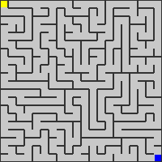

## Maze-Generator

---

## Prerequisites

* **GCC** (MinGW-w64 or equivalent) installed and added to your PATH.


---

## Getting Started(C)

1. **Clone the repository**

   ```bash
   git clone https://github.com/Swar028363/Maze-Generator.git
   cd Maze-Generator/c
   ```

2. **Build**

   ```bash
   gcc main.c stack/stack.c bmp/bmp.c maze_generator/maze_generator.c -o maze_generator
   ```

3. **Run**

   ```bash
   ./maze_generator
   ```

---

## Usage Example

Generate a 20×20 maze with default settings and output to `maze_<timestamp>.bmp`:

```bash
./maze_generator
```

Generate a customized maze and save to a specific path:

```bash
./maze_generator \
  -f output/maze.bmp \
  --dims 20 20 \
  --cell 10 \
  --wall 1 \
  --start 0 0 \
  --end 19 19 \
  --bgc 200 200 200 \
  --wc 50 50 50 \
  --sc 255 255 0 \
  --ec 0 0 255 \
  --verbose
```

---
## Output

Running the above command produces `output/maze.bmp`



---
